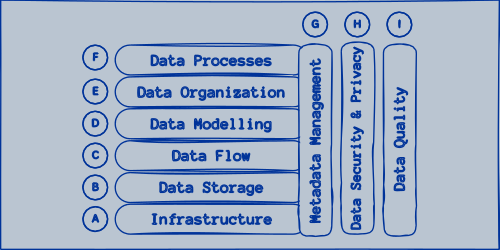
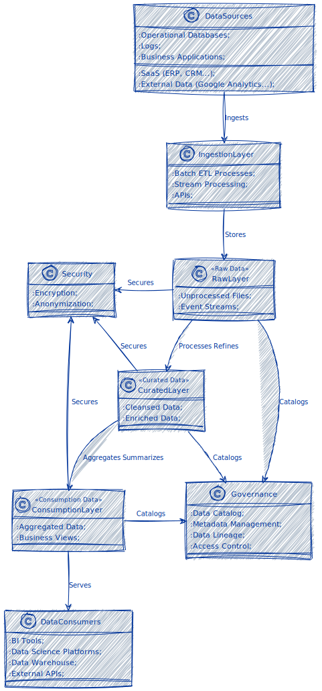

```admonish warning title="Page under construction"
:construction:
```

# Data Lake Architecture

Data Lake Architecture revolves around a centralized repository that facilitates the storage of all structured and unstructured data at any scale. The data stored can be in its raw format, and it's only transformed when it's ready to be used rather than pre-processing upon ingestion.

**Characteristics of Data Lake Architecture**:

* **Scalability**: Data lakes are designed to store vast amounts of data and can scale up or down as required, supporting petabytes or even exabytes of data.
* **Flexibility**: They can store various types of data, from structured data like databases and CSV files to unstructured data like emails, images, and videos.
* **Cost-Effectiveness**: Data lakes can be cost-effective by utilizing technologies like Hadoop or cloud-based storage solutions (e.g., AWS S3, Azure Data Lake Storage), leveraging commodity hardware or pay-as-you-go cloud services.
* **Schema-on-Read**: Unlike traditional data warehouses that use a schema-on-write approach, data lakes employ a schema-on-read approach, where the data structure is applied only when reading the data, providing flexibility in data analysis.
* **Advanced Analytics Support**: Data lakes facilitate advanced analytics through big data processing engines like Apache Spark or Apache Hadoop, supporting real-time analytics, machine learning, and predictive analytics.
* **Identification Key**: In a Data Lake, every data element is identified by a unique identifier and a set of metadata information.

<figure>
    
    <figcaption>Data Lake Architecture Conceptual & Physical Components.</figcaption>
</figure>

## Components

Here's a brief description of each component within the context of Data Lake Architecture:

**Conceptual & Physical Components**:

* &#x24B6; **Infrastructure**: Refers to the underlying physical and virtual resources that support the data lake, including hardware, network, compute, and storage resources. These are scalable and can be deployed on-premises or in the cloud.
* &#x24B7; **Data Storage**: The core of the data lake, where data is stored in its raw format. Storage solutions are designed to handle a vast amount of structured, semi-structured, and unstructured data efficiently.
* &#x24B8; **Data Flow**: Describes how data moves through the data lake from ingestion to consumption. It encompasses all the processes involved in extracting data from various sources, loading it into the lake, and transforming it for analysis.
* &#x24B9; **Data Modeling**: In the context of data lakes, data modeling is less about imposing a rigid schema upfront and more about applying structure to data as needed for specific analysis tasks, often in the processing or consumption layers.
* &#x24BA; **Data Organization**: Involves categorizing and arranging data within the data lake, often using folders, prefixes, or a cataloging system to make data easily discoverable and accessible.
* &#x24BB; **Data Processes**: Encompass all the operations performed on data within the lake, including ingestion, cleansing, transformation, and aggregation, to prepare it for analysis.
* &#x24BC; **Metadata Management**: Critical for maintaining an organized data lake, metadata management involves tracking data origins, format, structure, and transformations applied, facilitating governance, searchability, and analysis.

**Conceptual Only Components**:

* &#x24BD; **Data Security & Privacy**: Encompass strategies and technologies to protect data within every layer of the lake from unauthorized access and ensure compliance with privacy regulations. It includes encryption, access controls, and auditing mechanisms.
* &#x24BE; **Data Quality**: Refers to the measures and processes in place to ensure the data within the lake is accurate, complete, consistent, and reliable. Data quality management is vital for making trustworthy business decisions based on the data.

## Goals

Building and maintaining a Data Lake aims to achieve six primary goals: data unification, comprehensive query access, enhanced performance and scalability, data management progression, cost efficiency, and data governance and compliance.

* **Unification**: A Data Lake is an ideal repository for consolidating diverse data sources such as ERP and CRM systems, logs, partner data, and internally generated information into a single location. This unified architecture facilitates a comprehensive understanding of data, enabling the generation of actionable insights.
* **Full Query Access**: Data Lakes offer unrestricted access to stored data, allowing BI tools and data analysts to retrieve necessary information on demand. The ELT (Extract, Load, Transform) process supports this by enabling the flexible, reliable, and rapid ingestion of data into the Data Lake, followed by transformation and analysis using various analytical tools.
* **Performance and Scalability**: Data Lake architectures are designed for high-speed query processing and scalable data handling. They allow ad hoc analytical queries to be performed without impacting the operational systems, providing the agility to scale resources based on demand and ensuring business adaptability.
* **Progression**: Centralizing data within a Data Lake is a crucial step that sets the foundation for further data management enhancements. It streamlines interactions with BI tools and facilitates the improvement of data cleanliness, reducing redundancy and minimizing errors in the data.
* **Costs**: Cloud-based storage solutions like Amazon S3 offer an economical option for storing vast amounts of data in Data Lakes. Their scalable nature and cost-effective pricing models make them suitable for organizations looking to manage large data volumes efficiently while keeping storage costs in check.
* **Data Governance and Compliance**: Establishing robust data governance and compliance mechanisms within a Data Lake is crucial for managing data access, ensuring privacy, and adhering to regulatory standards. A well-structured Data Lake facilitates the implementation of policies and controls that govern data usage, lineage tracking, and auditing, thereby ensuring that the organization's data handling practices comply with legal and industry-specific regulations.

## Use Cases for Data Lake Architecture

```admonish example title="Big Data Analytics"
Data lakes are ideal for storing and analyzing big data, enabling organizations to derive insights from large volumes of diverse data sources.
```

```admonish example title="Machine Learning"
The vast and varied datasets in data lakes are invaluable for training machine learning models, providing the breadth and depth of data needed for accurate predictions and insights.
```

```admonish example title="Data Discovery and Visualization"
Analysts can explore and visualize data directly from the data lake to identify trends, patterns, and anomalies, fostering a data-driven culture within the organization.
```

```admonish example title="Real-Time Analytics"
By integrating real-time data processing frameworks, data lakes can support real-time analytics, enabling businesses to make informed decisions quickly.
```

## Challenges

* **Data Governance and Security**: Due to a data lake's vast size and variety of data, ensuring proper governance, security, and compliance can be challenging.
* **Data Quality**: Without careful management, data lakes can become "data swamps," where the lack of quality control and metadata can make the data difficult to find, understand, and trust.
* **Complexity**: The flexibility and scale of data lakes can lead to complexity in management, requiring specialized skills and tools to operate and extract value from the data lake effectively.

## Implementation

In practice, data lakes are often part of a larger data architecture, complementing data warehouses and other storage solutions.
Organizations might use data lakes for raw data storage and exploratory analytics while leveraging data warehouses for structured, curated data suitable for business intelligence and reporting.
This hybrid approach allows businesses to balance the flexibility and scale of data lakes with the performance and structure of traditional data warehouses.

<figure>
    
    <figcaption>Data Lake Architecture.</figcaption>
</figure>

This diagram illustrates the flow from various data sources through the ingestion layer, which captures both batch and real-time data.
The data then moves through the raw, curated, and consumption layers, each serving a different purpose in the data preparation process.
Data governance and security are overarching concerns that apply across all layers.
Finally, the processed and curated data is made available to various consumers, including BI tools and data science platforms, and possibly even back into a data warehouse or exposed through APIs.

The diagram shows a comprehensive view of the Data Lake Architecture, illustrating the different components and how data flows from its sources to its use in data-driven applications.
The following sections will discuss the architecture in detail, dividing its primary components into separate [layers](./layers.md) and [zones](./zones.md).
Each layer and zone serves a unique purpose, from initial data ingestion and storage to processing, governance, and the presentation of insights.
Understanding these layers and zones is important to comprehend how data lakes handle large amounts of diverse data, ensuring both scalability and flexibility while maintaining data integrity and accessibility.
The implementation of a Data Lake solution consists of some main [maturity stages](./maturity_stages.md), which also be discussed in the following sections.
