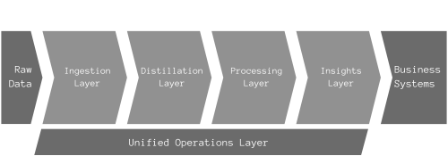

# Data Lake Layers

```admonish warning title="Page under construction"
:construction:
```

Data Lake layering was introduced to maximize the value and usability of the data stored within a Data Lake and address challenges related to data quality, governance, and accessibility.
These layers serve different purposes in the data management lifecycle and help organize data logically and efficiently, facilitating processing, analysis, and consumption.

The layered architecture, inspired by software engineering and systems design principles, has proven to be highly practical and efficient.
Abstraction layers separate concerns, enhance maintainability and improve scalability.
In the context of Data Lakes, layers such as Ingestion, Processing, and Insights allow for the separation of raw data management, data transformation and enrichment, and data access and visualization, respectively.
This approach not only simplifies the architecture but also ensures better governance, more efficient data processing, and easier access for end-users to derive insights.

<figure>
    
    <figcaption>Data Lake Architecture Layers.</figcaption>
</figure>

The layered data lake model approach is structured as follows:

* **Ingestion Layer**
* **Distillation Layer**
* **Processing Layer**
* **Insights Layer**
* **Unified Operations Layer**

The **Raw Data** entering the Data Lake consists of streaming and batch data from many sources, including Operational Systems and third-party data. Representing the data leaving the Data Lake, the **Business Systems** consists of databases, the Data Warehouse, dashboards, reports, and external data connections.

The Ingestion, Distillation, and Processing layers form what is known as the medallion architecture within a Data Lake. This data design pattern organizes data into three distinct layers, each designed to incrementally enhance the data's structure and quality as it progresses from one layer to the next. Also referred to as a 'multi-hop' architecture, this approach processes data across multiple, sequential stages, ensuring that with each 'hop,' the data becomes more refined and ready for analytical use.

## Ingestion Layer (Bronze or Raw)

The Bronze layer, serving as the essential entry point for all data entering the Data Lake, is designed to handle a diverse array of raw data, including logs, streams, files, database dumps, and data from third-party sources, in its unaltered, raw form.
This layer is engineered for high scalability, supporting both real-time streaming and batch ingestion processes to ensure that data is captured and stored efficiently and reliably.
The primary aim is to preserve the data's original state, with added metadata for improved traceability and manageability, facilitating reprocessing or analysis in its true form as necessary.

## Distillation Layer (Silver or Refined)

In the transition from the Ingestion to the Silver layer, also known as the Refined layer, raw data undergoes essential transformations to structure and organize it into a format more conducive to analysis.
This refining stage is crucial for cleansing, deduplicating, conforming, and enriching the data, ensuring consistency and reliability across the enterprise.
The modifications at this level are intentionally minimal yet precise, designed to prepare the data for more advanced analytics without incorporating complex business logic or extensive transformations reserved for the subsequent Processing (Gold) Layer.
This approach maintains a balance between making the data analytically accessible while preserving the granularity necessary for detailed examination.

## Processing Layer (Gold or Cured)

In the Gold Layer, also recognized as the Curated or Business layer, data undergoes its final transformations to emerge as fully prepared, enriched datasets tailored for specific business use cases and analytical endeavors.
This layer is distinguished by its highly curated, performance-optimized datasets readily accessible for BI reporting, advanced analytics, and machine learning applications.
Data models here are meticulously designed for consumption, often embodying business domains in denormalized structures, such as star schemas or subject-oriented data marts. They are enriched with dimensional models, aggregates, and KPIs to directly address the needs of business users and decision-makers.
The Gold layer ensures that data is not only reliable and understandable but also structured in a way that makes it immediately applicable to solving business challenges.

## Insights Layer

The Insights Layer is the interface for user interaction with the Data Lake.
It transforms data into actionable insights through dashboards, reports, and visual analytics.
It brings data to life, empowering users with the information needed for informed decision-making and guiding strategic actions within the organization.

## Unified Operations Layer

The backbone of any robust Data Lake architecture is its operations layer.
It integrates data governance, compliance, security, and performance optimization, ensuring the Data Lake's reliability and integrity as a critical organizational asset.

Together, these layers form a comprehensive framework for managing data in a Data Lake environment, supporting a wide range of analytical and operational use cases while ensuring data remains secure, high-quality, and accessible.

## The Medallion Architecture

The medallion or multi-hop architecture allows for a clear separation of concerns between data storage, processing, and consumption, providing several benefits:

* **Flexibility**: By separating data processing into distinct stages, the architecture provides flexibility in applying different transformations and data quality rules at each stage, allowing for iterative improvements and optimizations.
* **Scalability**: Each layer can scale independently based on the processing and storage needs, accommodating varying data volumes and complexity of transformations.
* **Governance and Quality Control**: The clear separation of data into raw, refined, and curated categories within the medallion architecture allows a more straightforward application of governance policies, data quality checks, and security measures at each stage. This structure enhances the data's reliability and trustworthiness.
* **Accessibility**: By the time data reaches the Gold layer, it's in a form that's readily accessible and usable by business analysts, data scientists, and decision-makers, speeding up the time-to-insight.

Overall, the medallion or multi-hop architecture is a comprehensive approach to managing data in a Data Lake, ensuring that data flows smoothly from ingestion to consumption while maintaining quality, governance, and accessibility.

## Use Case

```admonish todo
Guide Opetence Inc. to implement a layered data lake architecture.
```

At Opetence Inc., the data team is setting up a layered data lake architecture using Apache Airflow for orchestration and Amazon S3 for storage, focusing on ELT processes and data privacy.
The company hasn't moved to a data warehouse yet, so the analytics database (Aurora Postgres) will act as the data processing layer.
This use case won't cover the management of the database's demand for read/write operations.

### Custom Layered Data Lake Implementation

#### Setting Up the Infrastructure

* **Amazon S3** will serve as the backbone of the data lake, where all data, regardless of format, will be stored. Create a well-structured bucket hierarchy in S3 to represent each layer of the data lake (Ingestion, Distillation, Processing).
* **Apache Airflow** will orchestrate the data workflows, managing tasks such as triggering Airbyte for data ingestion, initiating data transformation jobs, and ensuring data moves correctly through each layer of the data lake.

#### Ingestion Layer Implementation

* **Airbyte**, deployed on Kubernetes, will pull data from various operational databases and third-party services. Airflow will trigger these Airbyte tasks, ensuring data is ingested into the S3 Ingestion Layer (Bronze) in a raw format.
* After ingestions, each object will include custom metadata, such as ingestion timestamps and source identifiers, to facilitate auditing and traceability.

#### Distillation Layer Implementation

* Data in the Distillation Layer (Silver) will be structured and cleansed. Airflow will execute Python scripts that transform raw data into a more analyzable format, performing tasks like schema validation, deduplication, and basic cleansing.
* Data masking and anonymization processes will be performed in this layer to protect PII and sensitive information. This can be achieved through predefined Airflow tasks that apply hashing, tokenization, or encryption techniques to sensitive fields.
* All files are in **Parquet** format.

#### Processing Layer Implementation

* The Processing Layer (Gold) is where data is further refined and prepared for specific analytical purposes. Airflow will manage complex data transformation jobs that might involve advanced data modeling techniques, aggregations, and summarizations to create domain-specific data marts or datasets in the analytics database, mainly using dbt.
* This layer should only contain high-quality, business-ready data that analysts can use to generate insights. The data should also be ready for use by BI and visualization tools.
* The decision not to maintain a separate Processing Layer within S3 is strategic, given the current team structure and resources. This is especially true because it allows the analytics team to maintain their data products independently from the data engineering team without having to know Python or Airflow.

#### Unified Operations Layer Implementation

* The team will leverage Airflow's logging and monitoring capabilities to implement the Unified Operations Layer. This includes tracking the health and performance of data workflows, auditing data lineage, and ensuring data quality across the data lake.
* Alerts and notifications will be set within Airflow to inform data engineers of any failures or issues in the data workflows.

### Cloud-Native Layered Data Lake Implementation

If Opetence Inc. were to implement a layered data lake solution using AWS cloud-native solutions, the following platforms would likely be adopted:

* **AWS DMS** could be used for initial and ongoing data migrations from operational databases to S3, offering a more managed solution compared to Airbyte.
* **AWS Glue** can serve both as a data catalog to manage metadata across the data lake and as an ETL service to transform data, potentially replacing custom Python scripts or Spark jobs managed by Airflow.
* **AWS Lake Formation** simplifies setting up a secure data lake and handling tasks like access control, data cataloging, and data clean-up, which might reduce the operational complexity of managing these aspects manually.
* **AWS Managed Workflows for Apache Airflow (MWAA)** would provide a managed environment to orchestrate complex workflows, such as data processing, transformation, and batch jobs, potentially enhancing the operational efficiency of data pipeline management compared to a self-managed Airflow setup.
* **dbt on ECS**: Deploying dbt models on **Amazon Elastic Container Service (ECS)** offers a scalable and serverless environment for running dbt transformations. This approach enables the company to leverage dbt's powerful data modeling capabilities within a containerized setup, ensuring consistent execution and easy scaling of data transformation tasks.

#### Comparison of Implementations

**Development Effort**:

* The Airflow + S3-based approach requires significant upfront development to set up workflows, scripts, and infrastructure configurations.
* Using AWS services like DMS, Glue, and Lake Formation can reduce development time due to their managed nature and built-in capabilities.

**Maintainability**:

* The custom Airflow + S3 solution might become complex to maintain as the data ecosystem grows due to the need to manage scripts, workflows, and infrastructure.
* AWS services offer better maintainability through managed services, reducing the burden of infrastructure management and scaling.

**Cost Implications**:

* The Airflow + S3 approach might have lower initial costs, especially if open-source tools are used and infrastructure is managed efficiently. However, operational costs can grow with scale due to the need for ongoing maintenance and management.
* While potentially higher in initial costs due to their managed nature, AWS services might offer better cost predictability and can scale more efficiently with demand.

Implementing a layered data lake architecture at Opetence Inc. requires careful consideration of the trade-offs between custom development and using managed services. The choice depends on the company's needs, skills, and long-term data strategy.
