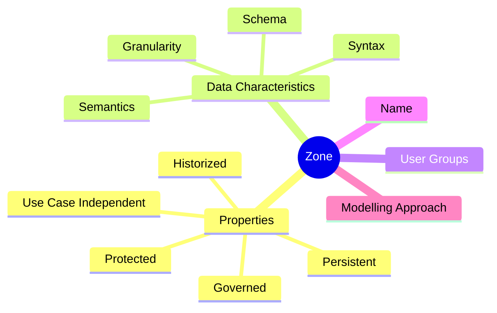

# Data Lake
> A Data Lake is a data repository for storing large amounts of Structured, Semi-Structured, and Unstructured data. 

It is a repository for storing all types of data in its native format without fixed limits on account size or file. Data Lake stores a high data quantity to increase native integration and analytic performance.
The Data Lake democratizes data and provides a cost-effective way of storing all organization data for later processing.

* auto-gen TOC;
{:toc}

## Data Lake vs Data Warehouse
> A Data Warehouse is a repository that exclusively keeps pre-processed data from a Data Lake or many databases.

ETL operations are used to arrange data in multi-dimensional structures so that Analytics workflows using Data Warehouses can be accelerated.
Business Intelligence specialists and Data Analysts can generate reports and develop dashboards using the data housed in a Data Warehouse.

Data Warehouses store data in a hierarchical format using files and folders. This is not the case with a Data Lake as Data Lake Architecture is a flat architecture. In a Data Lake, every data element is identified by a unique identifier and a set of metadata information.

## Goals
> Building and maintaining a Data Lake have five main goals: unifying the data, full query access, performance and scalability, progression, and costs.

**Unification**: Data Lake is a perfect solution to accumulate all the data from distinct data sources (ERP, CRM, logs, data partners data, internal generated data) in one place. The Data Lake Architecture makes it easier for companies to get a holistic view of data and generate insights from it.

**Full Query Access**: storing data in Data Lakes allows full access to data that can be directly used by BI tools to pull data whenever needed. ELT process is a flexible, reliable, and fast way to load data into Data Lake and then use it with other tools.

**Performance and Scalability**: Data Lake Architecture supports fast query processing. It enables users to perform ad hoc analytical queries independent of the production environment. Data Lake provides faster querying and makes it easier to scale up and down. Data Lake offer business agility.

**Progression**: getting data in one place is a necessary step before progressing to other stages because loading data from one source makes it easier to work with BI tools. Data Lake helps you make data cleaner and error-free data that has less repetition.

**Costs**: S3 repositories are a cost-efficient storage of large volumes of data.

## Data Lake Architecture

  <iframe loading="lazy" style="position: absolute; width: 100%; height: 100%; top: 0; left: 0; border: none; padding: 0;margin: 0;"
    src="https:&#x2F;&#x2F;www.canva.com&#x2F;design&#x2F;DAFbUxswrb4&#x2F;view?embed" allowfullscreen="allowfullscreen" allow="fullscreen">
  </iframe>

<a href="https:&#x2F;&#x2F;www.canva.com&#x2F;design&#x2F;DAFbUxswrb4&#x2F;view?utm_content=DAFbUxswrb4&amp;utm_campaign=designshare&amp;utm_medium=embeds&amp;utm_source=link" target="_blank" rel="noopener">
Data Lake Architecture Framework.
</a>

> Data Lakes are often structured in zones or layers models. These models define in which processing degrees (raw, cleansed, aggregated) data are available in the data lake, and how they are governed (regarding access rights, data quality, and responsibilities).

Zones are similar to the layers in data warehousing, but data may not move through all zones or even move back.

### Layers

  <iframe loading="lazy" style="position: absolute; width: 100%; height: 100%; top: 0; left: 0; border: none; padding: 0;margin: 0;"
    src="https:&#x2F;&#x2F;www.canva.com&#x2F;design&#x2F;DAFbVHIphys&#x2F;view?embed" allowfullscreen="allowfullscreen" allow="fullscreen">
  </iframe>

<a href="https:&#x2F;&#x2F;www.canva.com&#x2F;design&#x2F;DAFbVHIphys&#x2F;view?utm_content=DAFbVHIphys&amp;utm_campaign=designshare&amp;utm_medium=embeds&amp;utm_source=link" target="_blank" rel="noopener">
Data Lake Layers.
</a>

The following data lake model approach is structured in layers:
- Ingestion Layer
- Distilation Layer
- Processing Layer
- Insights Layer
- Unified Operations Layer

The **Raw Data** entering the Data Lake consists of the organizations internal data (Operational Systems), specially relational data from databases, also streaming and batch data from data partners.

In the other extreme, representing the data leaving the Data Lake, the **Business Systems**, consists of databases, the Data Warehouse, dashboards, reports, and external data connections.

The first three layers constitute the medallion architecture, which is a is a data design pattern used to logically organize data in a Data Lake (similar as in a Data Lakehouse), with the goal of incrementally and progressively improving the structure and quality of data as it flows through each layer of the architecture (from Bronze ⇒ Silver ⇒ Gold layer tables).
Medallion architectures are sometimes also referred to as "multi-hop" architectures.

#### Ingestion Layer (Bronze)
> The purpose of the Ingestion Layer of the Data Lake Architecture is to ingest raw data into the Data Lake. There is no data modification in this layer. This is where we land all the data from external source systems.

The table structures in this layer correspond to the source system table structures "as-is," along with any additional metadata columns that capture the load date/time, process ID, etc.
The focus in this layer is quick Change Data Capture and the ability to provide an historical archive of source (cold storage), data lineage, auditability, reprocessing if needed without rereading the data from the source system.

The layer can ingest raw data in real-time or in batches, which is in turn organized into a logical folder structure.
The Ingestion Layer can pull data from different external sources, like social media platforms.

#### Distillation Layer (Silver)
> The purpose of the Distillation Layer of the Data Lake Architecture is to convert the data stored in the Ingestion (Bronze) Layer in a Structured format for analytics. 

The data is matched, denormalized, merged, conformed, cleansed, and derive "just-enough" so that the Silver layer can provide an "Enterprise view" of all its key business entities, concepts and transactions (for example, master customers, stores, non-duplicated transactions and cross-reference tables).
The data in this layer becomes uniform in terms of format, encoding, and data type (parquet).

The Silver layer brings the data from different sources into an Enterprise view and enables self-service analytics for ad-hoc reporting, advanced analytics and ML. 
It serves as a source for Departmental Analysts, Data Engineers and Data Scientists to further create projects and analysis to answer business problems via enterprise and departmental data projects in the Gold Layer.

In the lakehouse data engineering paradigm (of which we’re extending to the Data Lake), typically the ELT methodology is followed vs. ETL - which means only minimal or "just-enough" transformations and data cleansing rules are applied while loading the Silver layer.
Speed and agility to ingest and deliver the data in the data lake is prioritized, and a lot of project-specific complex transformations and business rules are applied while loading the data from the Silver to Gold layer.
From a data modeling perspective, the Silver Layer has more 3rd-Normal Form like data models. Data Vault-like, write-performant data models can be used in this layer.

#### Processing Layer (Gold)
> This layer of the Data Lake Architecture executes user queries and advanced analytical tools on the Structured Data. 

The processes can be run in batch, in real-time, or interactively. 
It is the layer that implements the business logic and analytical applications consume the data.
It is also known as the Trusted, Gold, or Production-Ready Layer. 

It is typically organized in consumption-ready "project-specific" databases.
The Gold layer is for reporting and uses more de-normalized and read-optimized data models with fewer joins.
The final layer of data transformations and data quality rules are applied here.
Final presentation layer of projects such as Customer Analytics, Product Quality Analytics, Inventory Analytics, Customer Segmentation, Product Recommendations, Marking/Sales Analytics etc. fit in this layer.
We see a lot of Kimball style star schema-based data models or Inmon style Data marts fit.

Often, the Data Marts (and Data Warehouse data) from the traditional RDBMS technology stack are ingested into the Gold layer.

#### Insights Layer
> This layer of the Data Lake Architecture acts as the query interface, or the output interface, of the Data Lake. 

It uses SQL and NoSQL queries to request or fetch data from the Data Lake.
The queries are normally executed by company users who need access to the data.
Once the data is fetched from the Data Lake, it is the same layer that displays it to the user for viewing. 

Some examples include Amazon QuickSight, an AWS native BI tool and allows users to connect with software-as-a-service (SaaS) applications such as Salesforce or ServiceNow, third-party databases such as MySQL, Postgres, and SQL Server, as well as native AWS services including Amazon Athena, an interactive query service that allows them to analyze unstructured data in Amazon S3 data lakes using standard SQL queries.
While QuickSight doesn’t connect directly to the data lake, integration with Amazon Athena allows BI users to query data inside the lake without having to move data or build an ETL pipeline.

#### Unified Operations Layer
> This layer governs system management and monitoring.

It includes auditing and proficiency management, data management, workflow management. AWS data lake environments and monitoring tools and best practices are described here.

### Zones

  <iframe loading="lazy" style="position: absolute; width: 100%; height: 100%; top: 0; left: 0; border: none; padding: 0;margin: 0;"
    src="https:&#x2F;&#x2F;www.canva.com&#x2F;design&#x2F;DAFbVKs6Or4&#x2F;view?embed" allowfullscreen="allowfullscreen" allow="fullscreen">
  </iframe>

<a href="https:&#x2F;&#x2F;www.canva.com&#x2F;design&#x2F;DAFbVKs6Or4&#x2F;view?utm_content=DAFbVKs6Or4&amp;utm_campaign=designshare&amp;utm_medium=embeds&amp;utm_source=link" target="_blank" rel="noopener">
Zone Reference Model for Enterprise-Grade Data Lake Management - Data Flow.
</a>

The following data lake approach is explored by the [University of Stuttgart and Bosch GmbH](https://www.ipvs.uni-stuttgart.de/departments/as/publications/giebleca/20_zoneReferenceModel_EDOC_Preprint.pdf), and known as Zone Reference Model for Enterprise-Grade Data Lake Management. It consists of:
- Landing Zone
- Raw Zone
- Harmonized Zone
- Distilled Zone
- Delivery Zone
- Explorative Zone

Zone Reference Model for Enterprise-Grade Data Lake Management - meta-model for zones - attributes.

The following describes how a zone interacts with other zones and the outside world.

#TODO: draw and insert here meta-model diagrams for zone reference model.
Zone Reference Model for Enterprise-Grade Data Lake Management - meta-model for zones.

All zones contain a protected part.
This part is encrypted and secured, and stores data that need extensive protection (for example, PII, personal data). Data wander from the protected part of one zone to the protected part of the next zone.
They may only leave the protected part after being desensitized (for example, by anonymization).
Data in this part are subject to strict access controls and governance.
The protected part shares all other characteristics with the rest of the zone it is in.

#### Landing Zone
> The Landing Zone is the first zone of the data lake. Data are ingested as batch or as data stream from the sources.

The Landing Zone is beneficial when the requirements of the ingested data and those of the Raw Zone diverge.
For example, data might need to be ingested at a vast rate due to its volume and velocity.
If the technical implementation of the Raw Zone cannot provide this high ingestion rate, a Landing Zone can function as a mediator in between: data are ingested at a high rate into the Landing Zone, and then are forwarded to the Raw Zone as batches.
Examples of data coming to the Landing zone include data streamed by Kafka, Amazon Kinesis, Amazon SQS, RabbitMQ, Apache Spark, etc.

For the data characteristics, data ingested into the Landing Zone remains mostly raw.
Their granularity remains raw, just like in the source systems.
The schema of the data is not changed; they can simply be copied in their source system format.
However, their syntax might be changed.
Basic transformations are allowed upon ingestion into the Landing Zone, such as adjusting the character set of strings or transforming timestamps into a common format.
In addition, data may be masked or anonymized to comply with legal regulations.
Aside from these changes, the semantic of the data remains the same as in the source systems.

#### Raw Zone
> All data in the data lake is available in mostly raw format in the Raw Zone. Only basic transformations (see Landing Zone) are applied on the data. If the Landing Zone is omitted, these transformations are performed in the Raw Zone.

Differently from the Landing Zone, the Raw Zone stores data persistently.
In general, data should neither be manipulated nor deleted from the Raw Zone.
This zone persists (when possible) the original data type (json, csv, xml).

#### Harmonized Zone
> The Harmonized Zone is the place where master data are accessible for analyses.

A subset of the data stored in the Raw Zone is passed to the Harmonized Zone in a demand-based manner.
It is important to note that these data are not deleted from the Raw Zone.
Instead, the Harmonized Zone contains a copy of or a view on the data in the Raw Zone.
The Harmonized Zone is also the place where master data are accessible for analyses.
As these data are crucial for enterprises, master data management is of high importance in the data lake.
Thus, they should exclusively be accessed after being cleansed.

The data characteristics in this zone differ greatly from those in the Raw Zone.
Data schema and syntax change when compared to the source data.
Data from different source systems are integrated into a consolidated schema, regardless of their structure.
The data syntax is also consolidated in the Harmonized Zone: when data from multiple source systems are merged, data types have to be adapted.

The aim of the Harmonized Zone is to provide a harmonized and consolidated view on data.
To this end, the Harmonized Zone uses a standardized modeling approach (dimensional modeling or Data Vault) that all of the enterprise’s data are modeled in.
The files in this zone facilitates the ingestion (parquet).

#### Distilled Zone
> Prepares data for processing and facilitates ingestion.

In contrast to the Raw and Harmonized Zone, where the focus is to quickly make data available for use, the Distilled Zone focuses on increasing the efficiency of following analyses by preparing the data accordingly.
The granularity of the data may be changed (for example, data may be aggregated for the calculation of KPIs).
Complex processing is applied that change the data’s semantics but are too extensive for the Landing Zone, Raw Zone, and Harmonized Zone.
However, the schema might also change slightly, depending on the supported use case (for example, fields to enrich the data could be added).
The files in this zone facilitates the ingestion (parquet).

#### Explorative Zone
> The Explorative Zone is the place where data scientists can play with and flexibly use the data.

Data scientists can use and explore data in the data lake in any way they desire, except for sensitive data. These data are only usable according to strict rules. Granularity, schema, syntax, and semantic may be changed in any way necessary for analyses.

#### Delivery Zone
> In the Delivery Zone, small subsets of data are tailored to specific usage and applications.

This does not only include analytical use cases, such as reporting and OLAP, but also operational use cases.
This zone thus provides functionality similar to data marts and operational data stores in data warehousing.
Data from this zone may be forwarded to external data sinks.

The Delivery Zone especially supports users with little knowledge on data analytics.
Data have to be easily findable and importable into various analytics tools.
As for the modeling approach, data are available in whatever format supports the intended use case best, for example, dimensional modeling for OLAP, or flat tables for operational use.

#### Zones Comparisom
|  	| **Landing** 	| **Raw** 	| **Harmonized** 	| **Distilled** 	| **Explorative** 	| **Delivery** 	|
|---:	|:---:	|:---:	|:---:	|:---:	|:---:	|:---:	|
| **Granularity** 	| Raw 	| Raw 	| Raw 	| Aggregated 	| Any 	| Any 	|
| **Schema** 	| Any 	| Any 	| Consolidated 	| Consolidated, Enriched 	| Any 	| Any 	|
| **Syntax** 	| Basic transformations 	| Basic transformations 	| Consolidated 	| Consolidated 	| Any 	| Any 	|
| **Semantics** 	| Mostly unchanged* 	| Mostly unchanged* 	| Mostly unchanged* 	| Complex processing 	| Any 	| Any 	|
| **Governed** 	| True 	| True 	| True 	| True 	| False 	| True 	|
| **Historized** 	| False 	| True 	| True 	| True 	| N/A 	| N/A 	|
| **Persistent** 	| False 	| True 	| True 	| True 	| False 	| True 	|
| **Has Protected Part** 	| True 	| True 	| True 	| True 	| True 	| True 	|
| **Use Case Dependent** 	| False 	| False 	| False 	| True 	| True 	| True 	|
| **User Groups** 	| Systems, Processes 	| Data Scientists, Systems, Processes 	| Data Scientists, Systems, Processes 	| Data Scientists, Domain Experts, Systems, Processes 	| Data Scientists 	| Anyone 	|
| **Modelling Approach** 	| Any 	| Any 	| Standardized 	| Standardized 	| Any 	| Any 	|

Zone Reference Model for Enterprise-Grade Data Lake Management - Zones comparison.

### Sandbox
> Also known as the Analytics Sandbox, it provides data scientists and advanced analysts with a place for data exploration.

An Analytics Sandbox is a separate environment that is part of the overall data lake architecture, meaning that it is a centralized environment meant to be used by multiple users and is maintained with the support of IT. Some key characteristics of this layer:
- The environment is controlled by the analyst
- Allows them to install and use the data tools of their choice
- Allows them to manage the scheduling and processing of the data assets
- Enables analysts to explore and experiment with internal and external data
- Can hold and process large amounts of data efficiently from many different data sources; big data (unstructured), transactional data (structured), web data, social media data, documents, etc.

There are many advantages to having an Analytics Sandbox as part of your data architecture.
The most important is that it decreases the amount of time that it takes a business to gain knowledge and insight from their data.
It does this by providing an on-demand/always ready environment that allows analysts to quickly dive into and process large amounts of data and prototype their solutions without kicking off a big BI project.
In other words, it enables agile BI by empowering your advanced users.

Another major benefit to the business and IT team is that by giving the business a place to prototype their data solutions it allows the business to figure what they want on their own without involving IT.
When they decide that a solution is adding business value, it becomes a good candidate for something that should be productionized and built into the Data Warehouse process at some point.
This saves both teams a lot of time and effort.

### Maturity Stages
The implementation of a Data Lake solution consists of some main maturity stages.
1. Handle and ingest data at scale
2. Building the analytical muscle
3. Data Warehouse and Data Lake working in unison
4. Enterprise capability

#### Handle and Ingest data at scale
> This stage consists in improving the ability to transform and analyze data.

#### Building the analytical muscle
> This stage involves improving the ability to transform and analyze data.
 
In this stage, the company start acquiring more data and building applications.
In this stage, capabilities of the Data Warehouse and the Data Lake are used together.

#### Data Warehouse and Data Lake work in unison
> This step involves getting data and analytics into the hands of as many people as possible.

In this stage, the Data Lake and the Data Warehouse start to work in a union.
Both playing their part in analytics.

#### Enterprise capability in the lake
> In this maturity stage of the data lake, enterprise capabilities are added to the Data Lake.

It includes the adoption of information governance, information lifecycle management capabilities, and Metadata management.

## Key Components of Data Lake Architecture
#TODO: draw and include here diagram of data lake architecture including data sources, data processing layer, and data targets.

#### Data Ingestion
> Data Ingestion allows connectors to get data from a different data sources and load into the Data Lake.

Data Ingestion supports:
- All types of Structured, Semi-Structured, and Unstructured data.
- Multiple ingestions like Batch, Real-Time, One-time load.
- Many types of data sources like Databases, Webservers, Emails, and FTP.

#### Data Storage
> Data storage should be scalable, offers cost-effective storage and allow fast access to data exploration. It should support various data formats.

#### Data Governance
> Data governance is a process of managing availability, usability, security, and integrity of data used in an organization.

#### Security
> Security needs to be implemented in every layer of the Data Lake. It starts with Storage, Unearthing, and Consumption. The basic need is to stop access for unauthorized users. It should support different tools to access data with easy to navigate GUI and Dashboards.

Authentication, Accounting, Authorization and Data Protection are some important features of Data Lake security.

#### Data Quality
> Data quality is an essential component of Data Lake architecture. Data is used to exact business value. Extracting insights from poor quality data will lead to poor quality insights.

#### Data Discovery
> Data Discovery is another important stage before you can begin preparing data or analysis. In this stage, tagging technique is used to express the data understanding, by organizing and interpreting the data ingested in the Data Lake.

#### Data Auditing
> Data auditing helps to evaluate risk and compliance.

The main Data auditing tasks are:
- Tracking changes to important dataset elements
- Captures how/when/who changes to these elements.

#### Data Lineage
> This component deals with data’s origins. It mainly deals with where it movers over time and what happens to it. It eases errors corrections in a data analytics process from origin to destination.

#### Data Exploration
> It is the beginning stage of data analysis. It helps to identify right dataset is vital before starting Data Exploration.

All given components need to work together to play an important part in Data Lake building easily evolve and explore the environment.