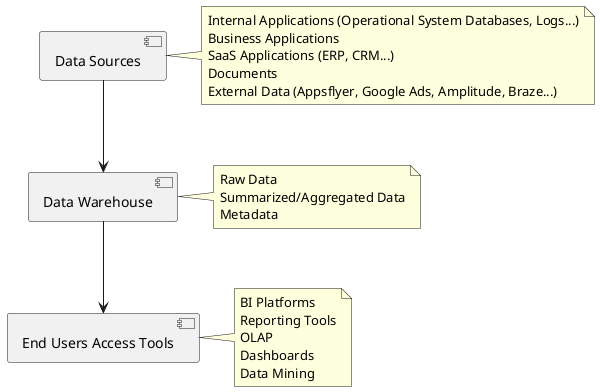
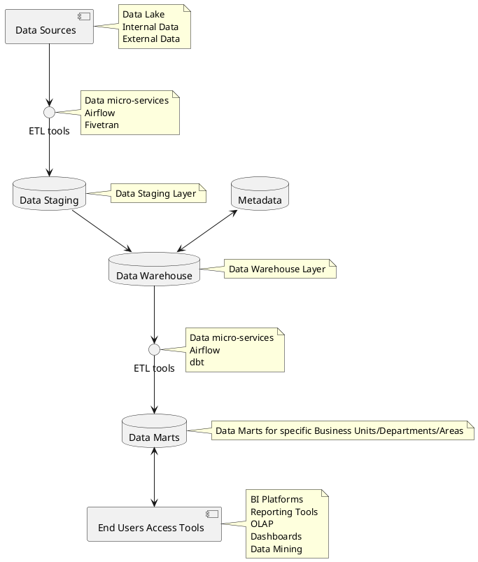
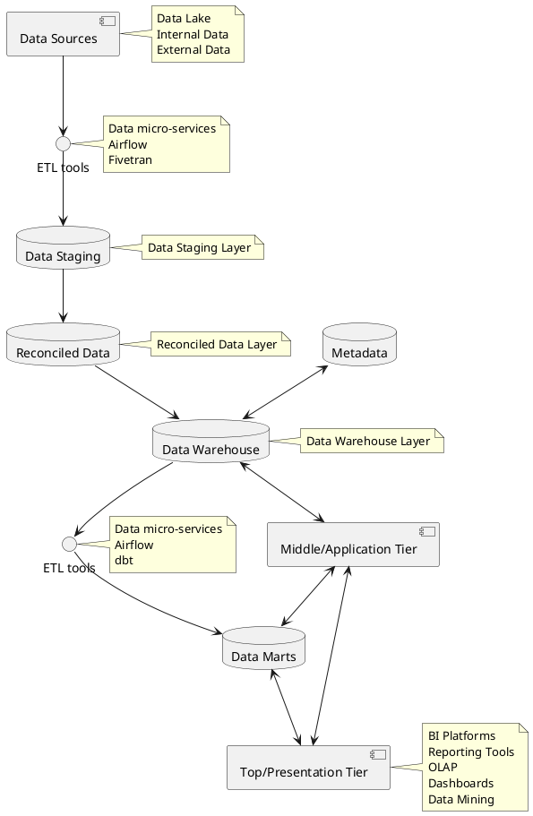

# Data Warehouse
> A **Data Warehouse** (DWH), also known as Enterprise Data Warehouse (EDW) is a central repository of information that can be analyzed to make more informed decisions. 

Data flows into a data warehouse from Data Lake, transactional systems, relational databases, and other sources, typically on a regular cadence. Business analysts, data engineers, data scientists, and decision makers access the data through Business Intelligence (BI) tools, SQL clients, and other analytics applications.

* auto-gen TOC;
{:toc}

## Goals
> When implementing a data warehouse, the main goals are to achieve: consistency, enable data-driven decision-making and improvement, and to maintain data Single Source of Truth.

**Consistency**: to maintain a uniform format to all collected data, making it easier for corporate decision-makers to analyze and share data insights with their colleagues. Standardizing data from different sources also reduces the risk of error in interpretation and improves overall accuracy.

**Decision-making**: successful business leaders develop data-driven strategies and rarely make decisions without consulting the facts. Data warehousing improves the speed and efficiency of accessing different data sets and makes it easier for corporate decision-makers to derive insights that will guide the business and marketing strategies that set them apart from their competitors.

**Improving**: allow business leaders to quickly access the organization historical activities and evaluate initiatives that have been successful — or unsuccessful — in the past. This allows executives to see where they can adjust their strategy to decrease costs, maximize efficiency and increase business results.

**Single Source of Truth**: the whole organization would benefit on having a single source of truth, specially when there are multiple data sources to a common business dimension.

## Data Warehouse Architecture

Data Warehouse Base Architecture.

There are several data warehouses architecture approaches available. Data warehouses would have in common some key components:

### Data Sources
> In most architectures approaches, it’s the Source Layer, or Data Source Layer, and consists on all the data sources the Warehouse Layer will consume.

**Operational System**: is a method used in data warehousing to refer to a system that is used to process the day-to-day transactions of an organization. Physically, it will normally refer to the databases the organization applications and micro-services create.

**Flat Files System**: is a system of files in which transactional data is stored, and every file in the system must have a different name.

### Warehouse
> In most architectures approaches, it’s the Warehouse Layer, or Data Warehouse Layer, and consists on all the data stored in RDBMS database with available gateway access (ODBC, JDBC, etc.). It also contains the metadata, and some degree of data summarization, and business logic applied, which differentiate an DWH database from a Production database.

#### Metadata
> Metadata is the road-map to a data warehouse, it defines the warehouse objects, and acts as a directory. This directory helps the decision support system to locate the contents of a data warehouse.

It normally contains:

1. A description of the Data Warehouse structure, including the warehouse schema, dimensions, hierarchies, data mart locations, contents, etc.
2. Operational metadata, which usually describes the currency level of the stored data (for example, active, archived or purged), and warehouse monitoring information (for example, usage statistics, error reports, audit, etc).
3. System performance data, which includes indices, used to improve data access and retrieval performance.
4. Information about the mapping from operational databases, which provides source RDBMSs and their contents, cleaning and transformation rules, etc.
5. Summarization algorithms, predefined queries, and reports business data, which include business terms and definitions, ownership information, etc.

Metadata management tool examples are Datahub, Open Metadata, and Amundsen.

#### Summarized data
> The area of the data warehouse that maintains all the predefined lightly and highly summarized (aggregated) data. The main goal is to speed up query performance, and the summarized records are updated continuously as new information is loaded into the warehouse.

### End-User access Tools
> The main purpose of a data warehouse is to provide information to the business for strategic decision-making. These end-users interact with the warehouse using end-client access tools.

The examples of some of the end-user access tools can be:
- Reporting and Query Tools
- Application Development Tools
- Executive Information Systems Tools
- Online Analytical Processing Tools
- Data Mining Tools

### Two-Tier Architecture

Two-Tier Data Warehouse Architecture.

**Data Source Layer**: A data warehouse system uses a heterogeneous source of data. That data is stored initially to the organization's relational databases or legacy databases, or it may come from an information system outside the organization walls.

**Data Staging Layer**: The data stored to the source should be extracted, cleansed to remove inconsistencies and fill gaps, and integrated to merge heterogeneous sources into one standard schema. The ETLs can combine heterogeneous schemata, extract, transform, cleanse, validate, filter, and load source data into a data warehouse. Note that this can be achieved in two ways:
1. Having the Distillation Layer (Silver) in the Data Lake as the Data Staging Layer.
2. Creating a separated database within the Data Warehouse, or a separated database schema. Following the principle that all the data in the data warehouse should be cleaned and have high quality standards, a separated database should be preferred.

**Data Warehouse Layer**: Information is saved to one logically centralized individual repository: a data warehouse. The data warehouses can be directly accessed, but it can also be used as a source for creating data marts, which partially replicate data warehouse contents and are designed for specific enterprise departments. Metadata repositories store information on sources, access procedures, data staging, users, data mart schema, and so on.

**Analysis Layer**: In this layer, integrated data is efficiently, and flexibly accessed to issue reports, dynamically analyze information, and simulate hypothetical business scenarios. It should feature aggregated information navigators, complex query optimizers, and customer-friendly GUIs.

### Three-Tier Architecture

Three-Tier Data Warehouse Architecture.

As the name of the architecture suggests, it consists of three tiers (levels):
1. Bottom/Data Tier: data warehouse server with functional gateway (ODBC, JDBC, etc.).
2. Middle/Application Tier: houses the business logic used to process user inputs. Example: OLAP Servers, Snowflake, Apache Redshift, Databricks Data Lakehouse Platform, Apache Spark.
3. Top/Presentation Tier: front-end tools.

The Bottom and Top tiers were already discussed in details in the previous section, so we only have left the implementation of the Middle Tier, very important to enable fast querying of the data warehouse. It is important to note the solutions to the middle tier are often referred as the Data Warehouse itself, but they’re only the Application tier/level in a complete data warehouse solution (It’s like saying Snowflake is the DWH, when it’s just one part of the complete DWH solution).

#### Reconciled Layer
The Reconciled Layer sits between the source data and data warehouse. The main advantage of the reconciled layer is that it creates a standard reference data model for the whole company. At the same time, it separates the problems of source data extraction and integration from those of data warehouse population. In some cases, the reconciled layer is also directly used to accomplish better operational tasks, such as producing daily reports that cannot be satisfactorily prepared using the corporate applications or generating data flows to feed external processes periodically to benefit from cleaning and integration.

This architecture is especially useful for the extensive, enterprise-wide systems. A disadvantage of this structure is the extra file storage space used through the extra redundant reconciled layer. It also makes the analytical tools a little further away from being real-time.

Please note that a reconciled layer could be part of the Data Warehouse, or the Data Lake (see Harmonized Zone, in Data Lake concepts chapter).

#### Middle/Application Tier
> Houses the business logic used to process user inputs. Example: OLAP Servers, Snowflake, Apache Redshift, Databricks Data Lakehouse Platform.

See details in the chapter [Data Warehouse Middle/Application Tier](./data_warehouse_application_tier.md)

## Data Modeling Methodologies
> Being one of the most important topics of data warehouse design and architecture, the data modeling methodology choosing process is arduous and polemic, and will impact the whole design and implementation of the data warehouse solution.

Specially for startups, the first versions or iterations of a data solution (implemented before the organization even start discussing the implementation of a data warehouse solution) will be very similar to a **Kimball** (or Bottom-up) methodology approach, though not planned explicitly as such. Which means the data marts (or the data to be accessed by the first BI tools adopted in the organization) are first formed based on the business requirements.

There are lots of advantages and disadvantages of priming this approach over a top-down approach (or any of the hybrid or alternative methodologies).

See all the details of the different data modelling methodologies in the chapter [Data Modelling](./data_modelling.md).

## Maturity Stages
#TODO

## Key Components of a Data Warehouse
**Data Ingestion**: allows connectors to get data from a different data sources and load into the Data Warehouse. The data will normally come from the Data Lake and External Sources connection (Fivetran), through multiple ETLs (Airflow, services, apps, ETL tools and platforms, etc.).

**Data Storage**: the data is stored in the data warehouse database, a relational database (RDBMS), like Postgres.

**Data Governance**: is a process of managing availability, usability, security, and integrity of data used in an organization.

**Security**: it needs to be implemented in every layer of the Data Warehouse. It includes setting up the data warehouse read-only by default, and setting up custom User Groups. It also includes the access to the databases (VPCs, VPNs, Whitelisting, etc.), strong and active DevOps monitoring and the enforcing of best practices in all levels of the data warehouse environment (data ingestion, data marts consumption, ETLs design, etc.).

**Data Quality**: it is an essential component of Data Warehouse architecture. Data is used to exact business value. Extracting insights from poor quality data will lead to poor quality insights.

**Data Discovery**: it is another important stage before you can begin preparing data or analysis. All this rely on good metadata, and data modeling.

**Data Auditing**: it helps to evaluate risk and compliance. Two major Data auditing tasks are tracking changes to the key dataset.
- Tracking changes to important dataset elements.
- Captures how/when/who changes to these elements.

**Data Lineage**: it deals with data’s origins. It mainly deals with where it movers over time and what happens to it. It eases errors corrections in a data analytics process from origin to destination. Some data modeling techniques may facilitate lineage in comparison to others (Vault vs Kimball vs Inmon).

**Data Exploration**: it is the beginning stage of data analysis. It helps to identify right dataset is vital before starting Data Exploration. All given components need to work together to play an important part in Data Warehouse building easily evolve and explore the environment.
