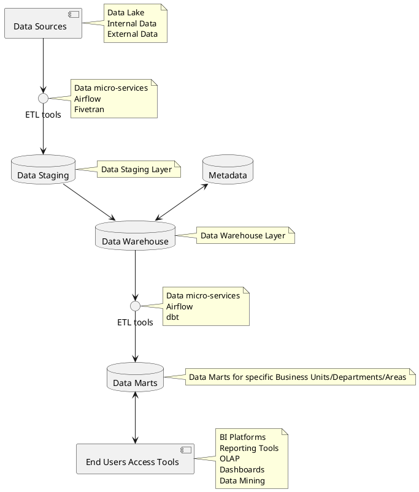
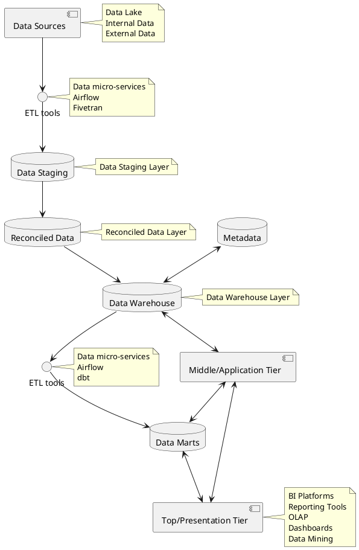

# Tier Architecture

## Two-Tier Architecture

Two-Tier Data Warehouse Architecture.

**Data Source Layer**: A data warehouse system uses a heterogeneous source of data. That data is stored initially in the organization's relational databases or legacy databases, or it may come from an information system outside the organization's walls.

**Data Staging Layer**: The data stored in the source should be extracted, cleansed to remove inconsistencies and fill gaps, and integrated to merge heterogeneous sources into one standard schema. The ETLs can combine heterogeneous schemata, extract, transform, cleanse, validate, filter, and load source data into a data warehouse. Note that this can be achieved in two ways:

1. Having the Distillation Layer (Silver) in the Data Lake as the Data Staging Layer.
2. Creating a separate database within the Data Warehouse, or a separate database schema. Following the principle that all the data in the data warehouse should be cleaned and have high-quality standards, a separate database should be preferred.

**Data Warehouse Layer**: The information is saved to one logically centralized individual repository: a data warehouse. The data warehouse can be directly accessed, but it can also be used as a source for creating data marts, which partially replicate data warehouse contents and are designed for specific enterprise departments. Metadata repositories store information on sources, access procedures, data staging, users, data mart schema, and so on.

**Analysis Layer**: In this layer, integrated data is efficiently, and flexibly accessed to issue reports, dynamically analyze information, and simulate hypothetical business scenarios. It should feature aggregated information navigators, complex query optimizers, and customer-friendly GUIs.

## Three-Tier Architecture

Three-Tier Data Warehouse Architecture.

As the name of the architecture suggests, it consists of three tiers (levels):

1. Bottom/Data Tier: data warehouse server with functional gateway (ODBC, JDBC, etc.).
2. Middle/Application Tier: houses the business logic used to process user inputs. Examples: OLAP Servers, Snowflake, Apache Redshift, Databricks Data Lakehouse Platform, Apache Spark.
3. Top/Presentation Tier: front-end tools.

The Bottom and Top tiers were already discussed in detail in the previous section, so we only have left to cover, the implementation of the Middle Tier, very important to enable fast querying of the data warehouse. It is important to note the solutions to the middle tier are often referred to as the Data Warehouse itself, but they’re only the Application tier/level in a complete data warehouse solution (It’s like saying Snowflake is the DWH when it’s just one part of the complete DWH solution).

### Reconciled Layer

The Reconciled Layer sits between the source data and the data warehouse. The main advantage of the reconciled layer is that it creates a standard reference data model for the whole company. At the same time, it separates the problems of source data extraction and integration from those of the data warehouse population. In some cases, the reconciled layer is also directly used to accomplish better operational tasks, such as producing daily reports that cannot be satisfactorily prepared using the corporate applications or generating data flows to feed external processes periodically to benefit from cleaning and integration.

This architecture is especially useful for extensive, enterprise-wide systems. A disadvantage of this structure is the extra file storage space used through the redundant reconciled layer. It also makes the analytical tools a little further away from being real-time.

Please note that a reconciled layer could be part of the Data Warehouse, or the Data Lake (see Harmonized Zone, in the Data Lake concepts chapter).

### Middle/Application Tier
>
> Houses the business logic used to process user inputs. Example: OLAP Servers, Snowflake, Apache Redshift, Databricks Data Lakehouse Platform.

See details in the chapter [Data Warehouse Middle/Application Tier](./data_warehouse_application_tier.md)
