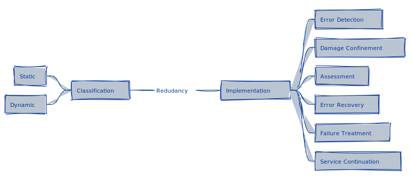

# Fault Tolerance

```admonish tip title="Fault Tolerance"
Given the limitations in fault prevention, especially as data and processes frequently change, it becomes necessary to resort to fault tolerance.
```

There are different levels of fault tolerance:

* **Full tolerance**: there is no management of adverse or unwanted conditions; the process does not adapt to internal or external values.

  ```admonish example title="Full Tolerance Example"
  A data ingestion pipeline is designed without error handling or validation mechanisms.
  Regardless of the quality or integrity of incoming data, the pipeline continuously processes and loads data into the data lake.
  This approach does not account for data anomalies, leading to potential data integrity issues downstream.
  ```

* **Controlled degradation** (or graceful degradation): notifications are triggered in the presence of faults, and if they are significant enough to interrupt the task flow (thresholds, non-existence, or unavailability of data), branch operators will select the subsequent tasks.

  ```admonish example title="Controlled Degradation Example"
  A financial reporting pipeline monitors the quality of incoming transaction data.
  Suppose data anomalies exceed a certain threshold, such as missing transaction IDs or inconsistent date formats.
  In that case, the pipeline triggers alerts to the data engineering team and switches to a less detailed reporting mode that relies on aggregated data rather than transaction-level detail.
  This ensures that reports are still generated, albeit with reduced granularity, until the data quality issue is resolved.
  ```

* **Fail-safe**: detected faults are significant enough to determine that the process should not occur; a short-circuit or circuit breaker operator cancels the execution of subsequent tasks, stakeholders are notified, and if there is no automatic process to deal with the problem, the data team can take actions such as rerunning the processes that generate the necessary inputs or escalating the case.

  ```admonish example title="Fail-Safe Example"
  An invoice generation pipeline processes daily transactions to produce invoices for partners.
  A fail-safe mechanism is integrated to check for data inconsistencies, such as duplicate transactions or irregular transaction values, before generating invoices.
  If discrepancies are detected that could lead to inaccurate billing, the pipeline automatically halts, preventing the generation and distribution of potentially erroneous invoices.
  The finance team and relevant stakeholders are notified of the halt, allowing the data team to investigate and rectify the issue.
  This ensures that partners are neither overcharged nor undercharged due to data inaccuracies, maintaining trust and compliance.
  ```

The design of fault-tolerant processes assumes:

* The task algorithms have been correctly designed.
* All possible failure modes of the components are known.
* All possible interactions between the process and its environment have been considered.

## Redundancy

```admonish tip title="Protective Redundancy"
All available fault techniques include adding external elements to the system to detect and recover from faults.
These elements are redundant in the sense that they are not necessary for the system's normal operation; this is called **protective redundancy**.
```

The goal of tolerance is to minimize redundancy while maximizing reliability, always under system complexity and size constraints. *Care must be taken when designing fault-tolerant systems, as components increase the complexity and maintenance of the entire system, which can in itself lead to less reliable systems*.

<p align="center">
  <figure>
    
    <figcaption>Redudancy Classification and Implementation.</figcaption>
  </figure>
</p>

Systems Redundancy is classified into static and dynamic.
**Static redundancy**, or masking, involves using redundant components to hide the effects of faults.
**Dynamic redundancy** is redundancy within a component that makes it indicate, implicitly or explicitly, that the output is erroneous; another component must provide recovery.
Dynamic redundancy involves not just the indication that an output is erroneous but also the system's ability to adapt or reconfigure in response to detected errors.

```admonish example title="Static Redundancy Example"
In a database system, static redundancy is implemented through mirroring, where data is replicated across multiple storage devices or locations in real time.
If one storage device fails, the system can seamlessly switch to a mirrored device without data loss or service interruption, effectively masking the fault from the end-users.
```

```admonish example title="Dynamic Redundancy Example"
A self-healing database cluster uses dynamic redundancy by continuously monitoring the health of its nodes.
If a node shows signs of failure, the cluster automatically initiates failover procedures to another node and possibly starts a replacement process for the faulty node, ensuring database availability and integrity with minimal manual intervention.
```

The key difference between static and dynamic redundancy is the approach to fault tolerance.
Static redundancy relies on duplicate resources ready to take over in case of failure, providing a straightforward but potentially resource-intensive solution.
On the other hand, dynamic redundancy incorporates intelligence and adaptability into the system, allowing it to respond to changing conditions and failures more efficiently, often with less overhead.

Whether static or dynamic, this fault tolerance technique has four phases: **error detection**, **damage confinement and assessment**, **error recovery**, and **failure treatment and service continuation**.

### 1. Error Detection

No fault tolerance action will be taken until an error has been detected.

```admonish tip title=""
The effectiveness of a fault-tolerant system depends on the **effectiveness of error detection**.
```

Error detection is classified into:

* **Environmental detections**: Errors are detected in the operational environment of the system, which are typically managed through exception-handling mechanisms.
* **Application detection**: Errors are identified in the application itself.
  * **Reverse checks**: Applied in components with an isomorphic relationship (one-to-one) between input and output. This method calculates an input value from the output value, which is then compared with the original. Inexact comparison techniques must be adopted when dealing with real numbers.
  * **Rationality checks**: Based on the design and construction knowledge of the system. They verify that the state of the data or the value of an object is reasonable based on its intended use.

```admonish example title="Environmental Detections Example"
A data ingestion pipeline monitors external data sources for updates.
If a source becomes unavailable due to network issues, the system triggers an exception, alerting the data engineering team to the connectivity problem.
This allows for quick resolution, ensuring continuous data flow.
```

```admonish example title="Reverse Checks Example"
A reverse check is performed on the report totals after creating a report summarizing the sales data by region.
This check redistributes the totals back to the expected sales per store based on historical proportions.
The newly distributed figures are then compared to the detailed sales data to ensure accurate report aggregation.
```

```admonish example title="Rationality Checks Example"
During data integration processes, a rationality check ensures that all foreign key values in a child table have corresponding primary key values in the parent table.
Records violating this constraint are identified as anomalies, indicating issues with data consistency or integrity across related tables.
```

### 2. Damage Confinement and Assessment

When an error is detected, the extent of the system that has been corrupted and its scope must be estimated (error diagnosis).

```admonish tip title=""
There will always be a time magnitude between the occurrence of a defect and the detection of the error, making it essential to assess any damage that may have occurred in this time interval.
```

Although the type of error detected can help evaluate the damage - when performing the error handling routine - erroneous information could have been disseminated through the system and its environment.
Thus, damage assessment is directly related to the precautions taken by the system designer for damage confinement.
Damage confinement refers to structuring the system in such a way as to minimize the damage caused by a faulty component.

**Modular decomposition** and **atomic actions** are two main techniques for structuring systems to facilitate damage confinement.
Modular decomposition means that systems should be broken down into components, each represented by one or more modules.
The interaction of the components occurs through well-defined interfaces, and the internal details of the modules are hidden and not directly accessible from the outside.
This structuring makes it more difficult for an error in one component to propagate to another.

Modular decomposition provides a static structure, while atomic actions structure the system dynamically.
An action is said to be atomic if there are no interactions between the activity and the system during the action.
These actions move the system from one consistent state to another and restrict information flow between components.

Both strategies contribute to damage confinement and system reliability by reducing the complexity and interdependencies that can lead to widespread system failures.

```admonish example title="Modular Decomposition and Atomic Actions Example"
* **Scenario**:
  A data analytics platform is designed to ingest, process, and visualize data from various sources, providing insights to business users.
  The platform comprises several microservices, including data ingestion, processing, storage, and visualization services.

* **Modular Decomposition**:
  The platform is divided into separate microservices, each responsible for a specific aspect of the data pipeline.
  For instance, the data ingestion service is distinct from the data processing service.

* **Atomic Actions**:
  One critical task in the data processing microservice is transforming raw data into a format that can be analyzed.
  This transformation process is designed to be an atomic action.
  It either completes successfully and moves the data to the next stage or, in the event of a failure, entirely rolls back all changes, leaving the system in its original state without any partial modifications.
```

The modular approach in this example separates individual components to make them easier to maintain and update without affecting others.
For instance, if the data processing service needs to be updated or replaced, it can be done independently of the ingestion and visualization services.
The atomic actions example ensures data integrity and consistency.
If the transformation operation encounters an error, such as a format inconsistency, the atomic design prevents partially transformed, potentially incorrect data from progressing through the pipeline.
This maintains the reliability of the data output and the overall system.

### 3. Error Recovery

Error recovery procedures begin once the detected error state and its possible damages have been assessed.

```admonish tip title=""
This phase is the most important within fault tolerance techniques.
It must transform an erroneous system state into another from which it can continue its normal operation, perhaps with some service degradation.
```

**Forward recovery** and **backward recovery** are the most common error recovery strategies.
The forward error recovery attempts to continue from the erroneous state by making selective corrections to the system's state, including protecting any aspect of the controlled environment that could be put at risk or damaged by the failure.

The backward recovery strategy consists of restoring the system to a safe state before the one in which the error occurred and then executing an alternative section of the task.
This section will have the same functionality as the section that produced the defect but using a different algorithm.
It is expected that this alternative will not produce the same defect as the previous version so that it will rely on the designer's knowledge of the possible failure modes of this component.

The designer must be clear about the service degradation levels, considering the services and processes that depend on it. Error recovery is part of the [Corrective Action and Preventive Action processes (CAPA)](./corrective_actions.md).

```admonish example title="Forward Error Recovery Example"
In a data aggregation pipeline summarizing daily social media engagement, specific post data is missing due to an outage in the platform's post-detail API for a particular subset of posts.
The pipeline implements a forward error recovery strategy by utilizing aggregate engagement data available from an alternative API with a different granularity (post type instead of individual posts).
This aggregate data and historical individual post engagement patterns are used to estimate the missing data for individual posts.
An alert is generated to notify the data team of the estimation used and advises a rerun of the pipeline once the platform confirms the API is fully operational, ensuring continuity and accuracy of the engagement summary.
```

```admonish example title="Backward Error Recovery Example"
Consider a scenario where a database update operation is part of a larger transaction in an e-commerce application.
If an error occurs during the update—perhaps due to a database constraint violation or an unexpected interruption—the backward error recovery mechanism would involve rolling back the entire transaction to its state before the update attempt.
This could be achieved through transaction logs or savepoints that allow the system to revert to a known good state.
After the rollback, an alternative update operation that corrects the cause of the original error (e.g., adjusting the data to meet constraints) can be attempted, or the system can alert an operator to resolve the issue manually.
This ensures the database remains consistent and free from partial updates that could lead to data integrity issues.
```

Both forward and backward error recovery strategies aim to restore the system to a state where normal operations can continue, either by moving past the error with a best-guess approach (forward) or by returning to a safe previous state (backward), thereby maintaining the overall integrity and reliability of the system.

### 4. Failure Treatment and Continued Service

The final phase of fault tolerance is to eradicate the failure from the system so that normal service can continue.

```admonish tip title=""
An error is a symptom of a defect and can lead to a failure. Although the immediate effects of the error might have been mitigated and the system returned to an error-free state, the underlying defect still exists. Therefore, the error may recur unless maintenance is performed to address the defect.
```

Key Actions in this Phase:

1. **Root Cause Analysis (RCA)**: Identify and understand the underlying cause of the failure, going beyond treating the symptoms (errors) to address the core issue (defect or fault).
2. **Implementing Fixes**: Based on the RCA{{footnote: Root Cause Analysis (RCA) is better explored later, in the chapter about [**Corrective Actions**](./corrective_actions.md).}}, develop and deploy solutions that rectify the identified defect and prevent the recurrence of the same failure.
3. **System Testing and Validation**: Rigorously test the system to ensure that the implemented fixes have resolved the issue without introducing new problems.
4. **Monitoring and Documentation**: Continuously monitor the system post-fix to ensure stable operation and document the incident, analysis, fix, and lessons learned for future reference.

```admonish example title="Failure Treatment and Continued Service Example"
Consider a data processing system for a retail company that aggregates sales data from various sources to generate daily sales reports. The system encounters a failure due to an unexpected data format change in one of the source systems, causing the aggregation process to produce incorrect sales totals.

* **Root Cause Analysis**: The data engineering team discovers that a recent update in the source system's software altered the data export format without prior notice.
* **Implementing Fixes**: The team updates the data ingestion scripts to accommodate the new data format and adds additional validation checks to flag any future unexpected changes in data formats from source systems.
* **System Testing and Validation**: The updated data processing pipeline is thoroughly tested with various data scenarios to ensure it can handle the new format correctly and is resilient to similar issues.
* **Monitoring and Documentation**: Post-deployment, the system is closely monitored for anomalies, and the incident is documented in the team's knowledge base, including details of the failure, analysis, fix, and preventive measures to avoid similar issues.
```

## Final Thoughts on Fault Tolerance

A well-designed fault tolerance strategy encompasses not only the implementation of redundancy and error detection mechanisms but also a comprehensive approach to system design that anticipates potential failures and mitigates their impact.

Incorporating both static and dynamic redundancy, along with robust error detection and recovery techniques, allows systems to maintain their functionality and integrity even in the face of hardware malfunctions, software bugs, or external disruptions.
This resilience is particularly vital in data engineering, analytics, and business intelligence contexts, where data accuracy and availability underpin critical decision-making processes.

As systems grow in complexity and scale, the importance of fault tolerance will only increase.
Adopting a mindset that prioritizes fault tolerance from the early stages of system design can transform potential vulnerabilities into strengths, ensuring that data systems can withstand challenges and continue to deliver value reliably.

Ultimately, fault tolerance is not just a set of technical solutions but a fundamental aspect of system architecture and operational culture that champions reliability, adaptability, and continuous improvement.
