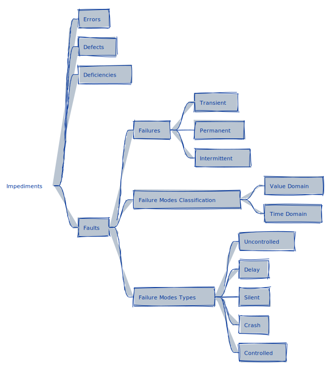

# Impediments

<p align="center">
  
</p>

## Failures, Errors, and Defects

```admonish tip title="Classifying System Impediments"
**Failures** result from unexpected internal problems that a system eventually exhibits in its external behavior. These problems are called **errors**, and their mechanical or algorithmic causes are called **defects** or **faults**.

When a system's behavior deviates from its specifications, it is said to have a **failure**, or the system has **failed**.
```

Systems are composed of **components**, each of which can be considered a system. Thus, a failure in one system can induce a fault in another, which may result in an error and a potential failure of this system. This failure can continue and affect any related system, and so on. A faulty system component will produce an error under specific circumstances during the system's lifetime.

```admonish hint
A system is the sum of external and internal states
```

An external state not specified in the system's behavior will be considered a failure. The system consists of many components (each with its many states), all contributing to its external behavior. The combination of these components' states is called the system's internal state. *An unspecified internal state is considered an error, and the component that produced the illegal state transition is said to be faulty*.

```admonish example title="Types of Failures"
* **Transient failures**: Begin at a specific time, remain in the system for some time, and then disappear.
* **Permanent failures**: Begin at a certain point and stay in the system until they are repaired.
* **Intermittent failures**: These are transient failures that occur sporadically.
```

## Failure Modes Classification

```admonish tip title="Defining Failure Modes"
A system can fail in many ways. A designer may design the system assuming a finite number of failure modes. However, the system may fail in ways that were not anticipated.

The failure mode is the specific way in which a part, component, function, equipment, subsystem, or system fails.
```

There are three types of failure modes that can occur with a service: **value failures**, **timing failures**, and **arbitrary failures**. Value failures, also known as value domain failures, happen when the value associated with a service is incorrect. Timing failures, or time domain failures, occur when a service is completed at the wrong time. Arbitrary failures are a combination of value and timing failures.

### Value Domain Failures

Value domain failures can be classified into **boundary errors** and **wrong values**. Boundary errors occur when the value is outside the expected range, including typing errors. Those errors are commonly referred to as **constraint errors**. On the other hand, wrong values occur when the value is within the correct range but is still incorrect.

```admonish example title="Constraint Errors Examples"
* An Apache Airflow DAG aggregating daily sales data failed due to an exceeding total sales amount, leading to a constraint error while inserting data into the database. This issue may have arisen because of an unexpected sales surge or an aggregation logic error.

* An ELT process may encounter a boundary error when migrating data from a source database field defined as VARCHAR(255) to a target database field defined as VARCHAR(50) if a record contains more than 50 characters. This could result in insertion failure and data loss.

* A dbt model calculates a new metric that results in negative inventory levels for certain products due to an error in the calculation logic. The database schema enforces a constraint that inventory levels must be zero or positive, leading to a boundary error when the model tries to update the inventory table with negative values.
```

```admonish example title="Wrong Value Examples"
* An Airflow task that updates a customer's loyalty points based on recent purchases mistakenly doubles the points due to a bug in the calculation logic. Although the updated loyalty points value remains within the acceptable range, it is incorrect, constituting a wrong value error.

* A dbt model designed to compute monthly revenue projections mistakenly uses an outdated exchange rate for currency conversion. While within the expected range, the resulting revenue figures are inaccurate due to the use of the wrong exchange rate, leading to a wrong value error.
```

In each of these examples, the integrity and reliability of the data are compromised, either by violating predefined constraints (boundary errors) or by producing incorrect but plausible values (wrong value errors). Addressing these errors requires thorough validation, testing, and monitoring of data pipelines to ensure data accuracy and integrity.

### Time Domain Failures

Failures in the time domain can cause the service to be delivered **too early**, **too late**, **infinitely late**, or **unexpected**.

* *Too early*: **premature failures** cause a service to be delivered before it is required.

  ```admonish example title="Premature Failure Examples"
  * An Airflow DAG is scheduled to trigger a data processing task that depends on data to be loaded by an earlier task. If the preceding task finishes earlier than expected and the dependent task starts processing incomplete data, it results in premature service delivery.

  * The AWS DMS task is configured to replicate data from a source to a target at specific intervals. If the replication task starts before the source system completes its data update cycle, it may replicate incomplete or stale data, leading to premature data availability in the target system.
  ```

* *Too late*: **delayed failures** cause a service to be delivered after it is required. These failures are commonly referred to as **performance errors**.

  ```admonish example title="Performance Errors Examples"
  * A dbt model aggregating daily sales data for reporting is scheduled to run after ETL processes are complete. If the dbt job experiences delays due to resource constraints or errors, the aggregated data becomes available too late, missing the reporting deadline.

  * An Airflow DAG that coordinates a sequence of data processing tasks is experiencing unexpected delays due to a long-running task. This is causing subsequent tasks, including critical data loads into the data warehouse, to be delayed, ultimately impacting downstream processes such as reporting or analytics.
  ```

* *Infinitely late*: **omission failures** cause the service never to be delivered.

  ```admonish example title="Omission Failure Examples"
  * An ELT task configured to migrate data from a legacy system to a new data lake fails to start due to configuration errors or connectivity issues. The data migration does not occur, resulting in an omission failure where the data service (migration) is never delivered.

  * A dbt model responsible for transforming and loading data into a data mart is disabled or deleted inadvertently. The transformation and load process is never executed, leading to an omission failure where the expected data mart is never populated.
  ```

* *Unexpected*: **commission failures** cause the service to be delivered without being expected. This type of failure is known as **improvisation**.

  ```admonish example title="Improvisation Failure Examples"
  * An Airflow DAG designed for monthly data archival is mistakenly triggered due to a manual intervention or a scheduling error, causing an unexpected data archival operation. This unexpected service might interfere with ongoing data processing or analysis tasks.

  * A dbt model meant to run on an ad-hoc basis for data cleanup is inadvertently included in the regular ETL schedule. This results in unexpected data modifications or deletions, which could affect data integrity and downstream data usage.
  ```

These examples highlight how timing issues in data processing workflows can lead to various types of service failures, emphasizing the importance of precise scheduling, error handling, and system monitoring to ensure timely and reliable data services.

### Failure Modes Types

In general, we can assume the modes in which a system can fail:

* **Uncontrolled failure**: A system that produces arbitrary errors in value and time domains (including improvisation errors).

  ```admonish example title="Uncontrolled Failure Example"
  An Airflow DAG responsible for data aggregation experiences a memory leak in one of its tasks, leading to erratic behavior where some data records are processed multiple times (value domain error), some are skipped entirely (omission error), and others are processed at unpredictable intervals (time domain error). The failures are arbitrary, impacting both the correctness of the data (value domain) and its timeliness (time domain).
  ```

* **Delay failure**: A system that produces correct services in the value domain but suffers from timing delays.

  ```admonish example title="Delay Failure Example"
  A dbt model that calculates end-of-month financial summaries experiences significant delays due to resource contention in the data warehouse. While the financial summaries are eventually calculated correctly (value domain is unaffected), they are not available in time for the monthly financial meeting (time domain error), constituting a delayed failure.
  ```

* **Silent failure**: A system that produces correct services in value and time domains until it fails. The only possible failure is omission, and when it occurs, all subsequent services will also suffer from omission failures.

  ```admonish example title="Silent Failure Example"
  An ELT task silently fails to replicate a subset of records from a source database to a data lake due to a transient network issue. The task does not report any errors; subsequent data loads continue as if nothing happened. However, the missing records lead to incomplete datasets in the data lake, representing omission failures that are not immediately apparent.
  ```

* **Crash failure**: A system presenting all the properties of a silent failure but allowing other systems to detect it has entered the state of silent failure.

  ```admonish example title="Crash Failure Example"
  The Airflow scheduler, responsible for triggering and managing data pipeline tasks, crashes due to an overload of scheduled jobs exceeding the system's available resources. The crash causes all data processing jobs managed by Airflow to halt, leading to a temporary cessation of data operations. However, the built-in health check mechanisms of the Airflow system detect the scheduler's unavailability and automatically initiate a restart procedure. The rapid detection and response to the crash ensure that the data pipelines are restored with minimal manual intervention, showcasing another instance of a crash failure where the system's failure state is quickly identified and mitigated.
  ```

* **Controlled failure**: A system that fails in a specified and controlled manner.

  ```admonish example title="Crash Failure Example"
  A dbt model performing data validation detects that incoming data exceeds predefined quality thresholds (e.g., too many null values in a critical column). The model deliberately enters a controlled failure state, rejecting the batch of data and triggering a predefined alert to the data quality team for review without processing the faulty data further.
  ```

A system consistently producing the correct services is classified as failure-free.

### Impediments Use Case

Let's consider an example involving a data pipeline that aggregates daily sales data for a retail company:

**Scenario**:
A data pipeline is designed to aggregate sales data from various stores at the end of each day and update a dashboard that the management team uses for decision-making.
The pipeline includes several steps: extracting data from store databases, transforming the data to align with the aggregation schema, and loading the data into a data warehouse where the aggregation occurs.

**Failure**:
One day, the management team noticed that the *sales dashboard had not been updated with the previous day's data*, even though the day had ended and the data should have been available.

**Error**:
Investigation reveals that the data transformation step in the pipeline failed due to an *unexpected data format in one of the store's sales records*.
This malformed record caused the transformation script to terminate unexpectedly, preventing the aggregated data from being loaded into the data warehouse.

**Defect**:
The root cause (defect) is identified as a *lack of proper data validation and error handling* within the transformation script. The script was not designed to handle records with this particular formatting anomaly, leading to its premature termination.

**Failure Domain**:
This is a failure in the *time domain*, as the expected service (daily sales data aggregation) was not delivered on time.

**Failure Mode Classification**:
The failure mode can be classified as *infinitely late* (omission failure) since the service (updating the dashboard with aggregated sales data) was never delivered for the affected day.

**Failure Mode Type**:
Given that the system did not alert the failure (the dashboard wasn't updated, with no error messages or alerts), this can be classified as a *silent failure*. The system failed to perform its intended function without providing any notification of the problem.

In this example, the defect in the data pipeline (*lack of robust data validation and error handling*) led to an error (*transformation script termination*), resulting in a failure (*dashboard not updated with the latest sales data*).
Understanding the distinction between defects, errors, and failures helps diagnose issues within systems and implement effective countermeasures to prevent recurrence.
