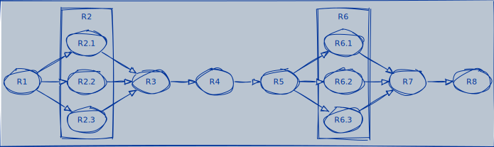

```admonish warning title="Page under construction"
:construction:
```

# Reliability Block Diagrams
>
> Reliability Block Diagrams (RBD) are a method for diagramming and identifying how the reliability of components (or subsystems) *R(t)* contributes to the success or failure of a redundancy. This method can be used to design and optimize components and select redundancies, aiming to lower failure rates.

An RBD is a series of connected blocks (in series, parallel, or a combination thereof), indicating redundant components, the type of redundancy, and their respective failure rates.

The diagram displays the components that failed and the ones that did not. If it is possible to identify a path between the beginning and end of the process with components that did not fail, it can be concluded that the process can be successfully executed.

Each RBD should include statements listing all relationships between components, i.e., what conditions led to using one component over another in the process execution.

## RBD Implementation in Data Engineering

RBDs can be particularly useful in data engineering to ensure the reliability and availability of data pipelines and storage systems. Here's how RBDs could be applied in the context of data engineering:

### Designing Data Pipelines

Data pipelines include stages like data collection, processing, transformation, and loading (ETL processes). An RBD can represent each stage as a block, with connections illustrating the data flow. This helps identify critical components whose failure could disrupt the entire pipeline, allowing engineers to implement redundancy or failovers specifically for those components.

### Infrastructure Reliability

In data engineering, the infrastructure includes databases, servers, network components, and storage systems. An RBD can help visualize the relationship between these components and their impact on overall system reliability. For example, a database cluster might be set up with redundancy to ensure that the failure of a single node doesn't result in data loss or downtime, represented in an RBD by parallel blocks for each redundant component.

### Dependency Analysis

RBDs can help data engineers understand how different data sources and processes depend on each other. For instance, if a data pipeline relies on multiple external APIs or data sources, the RBD can illustrate these dependencies, highlighting potential points of failure if one of the external sources becomes unreliable.

### Optimizing Redundancies

By using RBDs, data engineers can identify areas where redundancies are necessary to maintain data availability and system performance. This is crucial for critical systems where data must be available at all times. For example, in a data replication strategy, the RBD can help determine the number of replicas needed to achieve the desired level of reliability.

### Failure Mode Analysis

RBDs allow for the identification of single points of failure within the system. Understanding how individual components contribute to the overall system reliability enables data engineers to prioritize efforts in mitigating risks, such as adding backups, introducing data validation steps, or improving error-handling mechanisms.

### Scalability and Maintenance Planning

As data systems scale, RBDs can be updated to reflect new components and dependencies, helping engineers plan for maintenance and scalability while minimizing the impact on reliability. This foresight ensures the system can grow without compromising performance or data integrity.
In summary, Reliability Block Diagrams offer a systematic approach for data engineers to design, analyze, and optimize data systems for reliability. By visualizing component dependencies and identifying critical points of failure, RBDs facilitate informed decision-making to enhance system robustness and ensure continuous data availability.

In summary, Reliability Block Diagrams offer a systematic approach for data engineers to design, analyze, and optimize data systems for reliability. By visualizing component dependencies and identifying critical points of failure, RBDs facilitate informed decision-making to enhance system robustness and ensure continuous data availability.

## RBD Implementation in Data Reliability Engineering

While data engineering primarily uses Reliability Block Diagrams (RBDs) to design and detail the individual tasks within data pipelines, data reliability engineering adopts RBDs to assess and enhance the overall system's robustness. In the data reliability context, RBDs extend beyond the pipeline to encompass the entire data ecosystem, including data sources, storage, and processing components, focusing on how these elements collectively contribute to the system's reliability and pinpointing potential vulnerabilities that could impact data integrity and availability.

### Component Identification

Start by identifying all critical components of your data ecosystem that contribute to the overall reliability of data services. This includes data ingestion mechanisms, transformation processes (like ETL/ELT jobs), data storage systems (databases, data lakes, data warehouses), data processing applications, and data access layers.

### Diagram Construction

Construct the RBD by representing each identified component as a block. The arrangement of these blocks should reflect the logical relationship and dependencies between components, with connections indicating the data flow. For example, an ETL job block might be connected to both a source database block and a data warehouse block, showing the data flow from source to target.

### Reliability Representation

Assign reliability values to each block based on historical performance data, such as uptime, failure rates, or mean time between failures (MTBF). These values can be derived from monitoring and logging tools, past incident reports, or vendor specifications for managed services.

### Analysis

Use the RBD to analyze the overall system reliability. This can involve calculating the reliability of serial and parallel configurations within the diagram. The system's reliability is the product of the individual reliabilities for serial configurations (where components depend on each other). For parallel configurations (where components can compensate for each other's failure), the system's reliability is enhanced and requires a different calculation approach.

### Identification of Weak Points

The RBD can help identify system parts that significantly impact overall reliability. Components with lower reliability values or critical single points of failure become evident, guiding where improvements or redundancies are needed.

### Redundancy Planning

Based on the analysis, plan for redundancy and fault tolerance in critical components. For example, if a data storage system is identified as a weak point, consider introducing replication or a failover system to enhance reliability.

### Continuous Improvement

As the data system evolves, continuously update the RBD to reflect changes and improvements. Regularly revisiting the RBD can help maintain an up-to-date understanding of the system's reliability and make informed decisions about further enhancements.

### Example Use Case

Imagine a data platform where raw data is ingested from various sources into a data lake, processed through a series of transformation jobs in Apache Spark, and then loaded into a data warehouse for analytics. An RBD for this platform would include blocks for each data source, the data lake, Spark jobs, and the data warehouse. By analyzing the RBD, the data reliability engineering team might find that the transformation jobs are a reliability bottleneck. To address this, they could introduce redundancy by parallelizing the Spark jobs across multiple clusters, thereby enhancing the overall reliability of the data platform.

### Example Diagram

<p align="center">
  <figure>
    
    <figcaption>Reliability Block Diagrams (RBD) - Example.</figcaption>
  </figure>
</p>

Reliability Block Diagrams offer a systematic approach to understanding and improving the reliability of data systems, making them a valuable tool in the arsenal of data reliability engineering.

## Adoption

Reliability Block Diagrams (RBD) are widely adopted in industries where system reliability, availability, and failure analysis are crucial. Industries that commonly use RBD include:

Aerospace and Aviation: For analyzing the reliability of aircraft systems and components to ensure safety and compliance with stringent aviation standards.
Automotive: In the design and analysis of vehicle systems to improve reliability and safety while reducing the likelihood of failures.
Manufacturing: To optimize production lines, machinery, and equipment for maximum efficiency and minimal downtime.
Power Generation and Utilities: For ensuring the reliability and uninterrupted operation of power plants, electrical grids, and water supply systems.
Telecommunications: In designing and maintaining networks and systems to ensure high availability and minimal service disruptions.
Defense and Military: To assess and enhance the reliability of weapons systems, vehicles, and communication systems.
Electronics and Semiconductor: For reliability analysis of electronic devices, components, and systems to minimize failures and extend product life.
Oil and Gas: In the design and maintenance of drilling, extraction, and processing equipment to prevent costly and potentially hazardous failures.
Healthcare and Medical Devices: To ensure the reliability and safety of medical equipment and devices critical to patient care.
Space Exploration: For analyzing the reliability of spacecraft, satellites, and mission-critical systems to prevent failures in space missions.
These industries rely on RBD to predict system behavior under various conditions, identify potential points of failure, and develop strategies to enhance system reliability and safety.

Reliability Block Diagrams (RBD) are commonly adopted by engineering professionals who are involved in the design, analysis, and maintenance of complex systems where reliability and safety are critical. These professionals typically include:

Reliability Engineers: Regardless of their specific engineering discipline, reliability engineers use RBDs to analyze and improve the reliability of systems and components.
Systems Engineers: They apply RBDs to ensure that entire systems function reliably as intended, especially in complex, interdisciplinary projects.
Mechanical Engineers: They often use RBDs in the design and analysis of mechanical systems to identify potential failure points and improve system reliability.
Electrical and Electronic Engineers: These professionals use RBDs for designing and analyzing electrical systems, circuits, and components to ensure reliability and safety.
Aerospace Engineers: Involved in designing and maintaining aircraft and spacecraft, they use RBDs to assess system reliability and safety.
Automotive Engineers: They apply RBDs in the automotive industry to design vehicles that are reliable and safe under various operating conditions.
Industrial Engineers: In manufacturing and production, industrial engineers use RBDs to optimize processes and machinery for reliability and efficiency.
Chemical Engineers: They might use RBDs in the design and operation of chemical plants and processes to ensure they operate reliably and safely.
Software Engineers: Especially those involved in high-reliability software systems, such as those used in aerospace, healthcare, and finance, may use concepts similar to RBDs to ensure software reliability.
Civil Engineers: For large-scale infrastructure projects, civil engineers might use RBDs to ensure the reliability and safety of structures such as bridges, dams, and buildings.
These professionals, across various disciplines, leverage RBDs to quantify reliability, identify weaknesses, and inform decisions on improvements or redundancies needed to achieve desired reliability levels in their systems and projects.

Data engineers often adopt processes and tools that resemble aspects of Reliability Block Diagrams (RBD) but are tailored to the specific needs and challenges of data systems. Some of these processes and tools include:

Data Lineage Tools: These tools help in understanding the flow of data through various processes and transformations, similar to tracing paths in RBDs. They can highlight potential failure points in data pipelines.

Data Quality Platforms: Platforms like Great Expectations or Deequ allow data engineers to define and enforce data quality checks, akin to ensuring component reliability in an RBD.

Workflow Orchestration Tools: Tools like Apache Airflow or Prefect can be used to design and manage complex data workflows with conditional paths and error handling, similar to modeling system redundancies and failure paths in RBDs.

Monitoring and Alerting Systems: Systems like Prometheus, Grafana, and Datadog provide real-time monitoring of data pipelines and infrastructure, alerting on anomalies or failures, much like an RBD highlights system vulnerabilities.

Data Observability Platforms: Platforms such as Monte Carlo or Databand provide comprehensive observability into data systems, allowing engineers to detect, diagnose, and resolve data reliability issues.

Disaster Recovery and High Availability Strategies: Implementing strategies for data backup, replication, and failover mechanisms to ensure data availability and reliability.

Microservices Architecture: Adopting a microservices architecture for data applications can improve resilience and reliability, as each service can be designed, deployed, and scaled independently.

While not a direct one-to-one replacement for RBDs, these tools and processes collectively provide data engineers with a framework to ensure data reliability, availability, and integrity, similar to the objectives of RBDs in traditional engineering disciplines.
