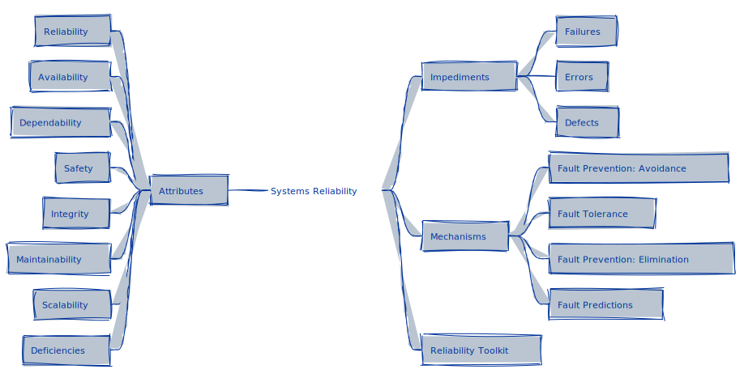

```admonish warning title="Page under construction"
:construction:
```

# Systems Reliability

```admonish tip title="Defining Systems Reliability"
Systems reliability is determined by its adherence to a clear, complete, consistent, and unambiguous behavior specification.
A reliable system performs predictably without errors or failures and consistently delivers its intended service.
```

This chapter aims to provide an in-depth understanding of the concepts of Reliability and Safety as presented by Alan Burns and Andy Wellings in their book{{footnote: Alan Burns and Andrew J. Wellings. 2001. Real-Time Systems and Programming Languages: ADA 95, Real-Time Java, and Real-Time POSIX (3rd. ed.). Addison-Wesley Longman Publishing Co., Inc., USA.}} "Real-Time Systems and Programming Languages."
These concepts, and many others, have been developed by different industries over several decades and consolidated in the sub-discipline of systems engineering known today as **Reliability Engineering**.

I will supplement these concepts by looking at reliability in other engineering fields, such as mechanical and industrial engineering, drawing comparisons and analogies to help you better understand the core concepts.

Lastly, I will contextualize these concepts with the current reliability concepts being worked on in the software, data, and computer systems industry.
I will explore many tools and frameworks data teams can use to design and manage reliable data systems.

I divided this chapter into [**Impediments**](./systems-reliability/impediments.md), [**Attributes**](./systems-reliability/attributes.md), and [**Mechanisms**](./systems-reliability/mechanisms.md).

```admonish tldr title="Impediments"
Impediments prevent a system from functioning perfectly or are a consequence of it.
This chapter covers impediment classification, including **Failures**, **Errors**, and **Defects**.
```

```admonish tldr title="Attributes"
Attributes are the ways and measures by which the **quality of a reliable service can be estimated**.
```

```admonish tldr title="Mechanisms"
This chapter addresses systems reliability mechanisms by internalizing and adopting best practices or applying specific methodologies, architectures, or tools.
This chapter aims to create a **data systems reliability framework** that engineers can adopt from earlier implementation phases, such as the design phase.
```

<p align="center">
  <figure>
    
    <figcaption>Systems Reliability - Concepts.</figcaption>
  </figure>
</p>
