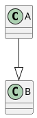
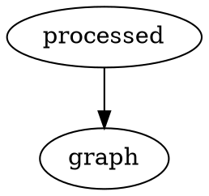

# Test Diagrams

## Mermaid

```mermaid
graph TD;
    A-->B;
    A-->C;
    B-->D;
    C-->D;
```

## PlantUML

```plantuml
@startuml
A --|> B
@enduml
```

## Graphviz

```dot process
digraph {
    "processed" -> "graph"
}
```
